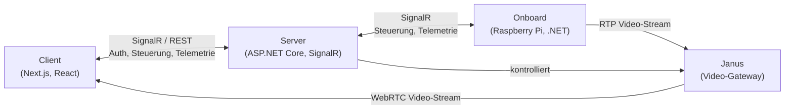
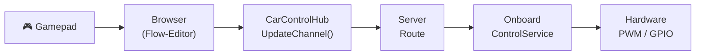
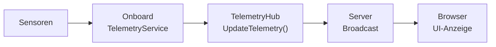
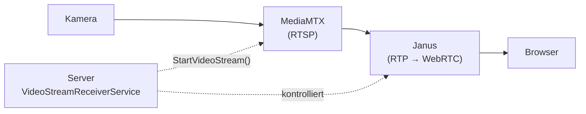
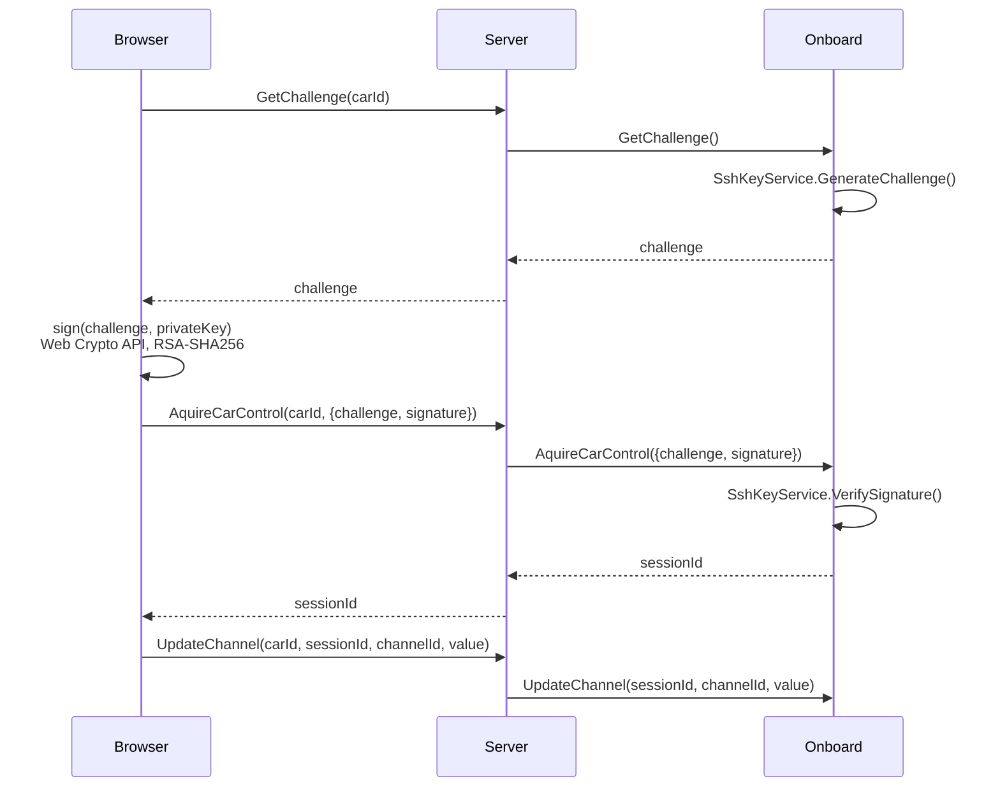
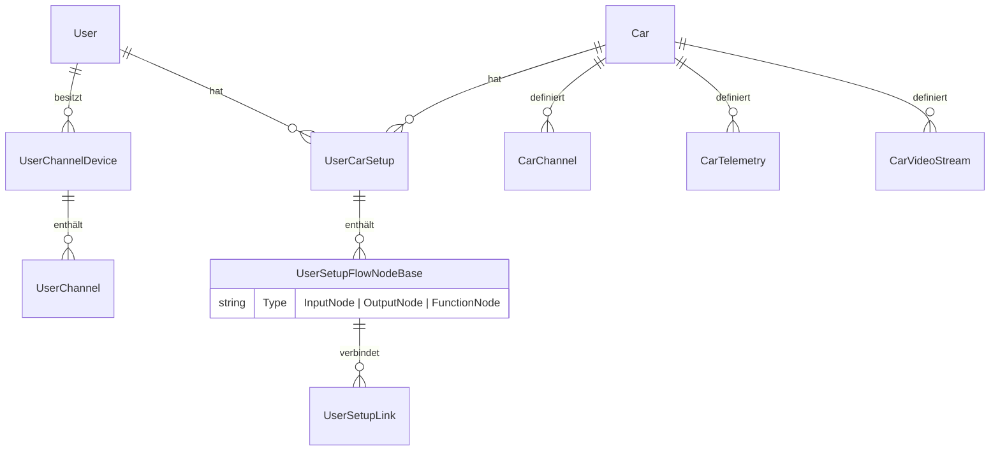

# Architektur – LteCar

## Überblick

LteCar ist ein System zur Fernsteuerung von Fahrzeugen über das Internet (LTE/WLAN). Ein Benutzer steuert über eine Web-Oberfläche ein reales Fahrzeug in Echtzeit, sieht dessen Kamerabild per WebRTC-Videostream und empfängt Telemetriedaten. Die Kommunikation zwischen allen Komponenten läuft primär über **SignalR** (WebSocket-basiert).

---

## Projekte und Technologien

| Projekt | Beschreibung | Technologien |
|---------|-------------|-------------|
| **Server** | Zentraler Hub für Fahrzeuge und Benutzer. Hostet die REST-API und alle SignalR-Hubs. Verwaltet Datenbank, Videostreams und Routing. | ASP.NET Core 8, SignalR, EF Core 9 (SQL Server), MessagePack |
| **Onboard** | Läuft auf dem Fahrzeug (Raspberry Pi). Verbindet sich zum Server, empfängt Steuerbefehle, steuert Hardware (PWM/GPIO), sendet Telemetrie und Video. | .NET 8 Console App, System.Device.Gpio, TypedSignalR, MediaMTX |
| **Client** | Web-UI im Browser. Steuerung per Gamepad, Konfiguration über Flow-Editor, Videoempfang per WebRTC. | Next.js 15, React 19, ReactFlow, Zustand, Web Crypto API |
| **Shared** | Gemeinsame DTOs, Interfaces und Utilities für Server und Onboard. | .NET 8 Class Library |
| **Janus** | WebRTC-Gateway. Empfängt RTP-Streams vom Fahrzeug und liefert sie per WebRTC an den Browser. | Janus Gateway (extern) |

---

## Akteure

### Benutzer (Web User)

Der Benutzer öffnet die Web-Anwendung im Browser. Er wählt ein Fahrzeug aus, authentifiziert sich per SSH-Key-Challenge, konfiguriert die Steuerung über einen visuellen Flow-Editor und steuert das Fahrzeug mit einem Gamepad. Er sieht das Kamerabild und empfängt Telemetriedaten in Echtzeit.

### Fahrzeug (Onboard)

Das Fahrzeug ist ein Raspberry Pi mit angeschlossener Hardware (Motoren, Servos, Sensoren, Kamera). Die Onboard-Software verbindet sich beim Start automatisch mit dem Server, registriert sich mit ihrem `CarIdentityKey`, synchronisiert die Kanal-Konfiguration (ChannelMap) und wartet auf Steuerbefehle. Sie streamt Video über MediaMTX und sendet Telemetriedaten.

### Server

Der Server ist der zentrale Vermittler. Er verwaltet Benutzer-Sessions, Fahrzeugverbindungen und die Datenbank. Er routet Steuerbefehle vom Browser an das richtige Fahrzeug und Telemetriedaten zurück. Er kontrolliert Janus für das Video-Streaming und stellt die REST-API für CRUD-Operationen bereit.

### Janus (Video-Gateway)

Janus empfängt RTP-Videostreams von den Fahrzeugen und konvertiert sie in WebRTC-Streams für den Browser. Der Server steuert Janus über dessen API (Port-Allokation, Stream-Verwaltung).

### Gamepad

Ein physisches Eingabegerät (z.B. Xbox-Controller), das im Browser über die Gamepad-API ausgelesen wird. Die Achsen und Buttons werden über den Flow-Editor auf Fahrzeug-Kanäle gemappt.

---

## Signalfluss

### Steuerung (Gamepad → Fahrzeug)

1. Der Browser liest die Gamepad-Eingabe und aktualisiert die Input-Nodes im Flow-Graphen.
2. Der Flow-Graph propagiert die Werte durch Funktionsknoten (Rescale, Clamp, Gearbox, ...) zu den Output-Nodes.
3. Jeder Output-Node ruft `UpdateChannel(carId, sessionId, channelId, value)` über den **CarControlHub** auf.
4. Der Server routet den Aufruf anhand der `connectionMap` an die SignalR-Verbindung des Fahrzeugs.
5. Der `ControlService` auf dem Fahrzeug delegiert an den `ControlExecutionService`, der den Wert an die Hardware (PWM/GPIO) weitergibt.

### Telemetrie (Fahrzeug → Browser)

1. Der `TelemetryService` auf dem Fahrzeug liest periodisch die Sensoren aus.
2. Er ruft `UpdateTelemetry(carId, channelName, value)` über den **TelemetryHub** auf.
3. Der Server broadcastet den Wert an alle Clients in der Gruppe des Fahrzeugs.

### Video (Fahrzeug → Browser)

1. Der Browser fordert einen Videostream über den **CarVideoHub** an.
2. Der Server allokiert einen Janus-RTP-Endpoint über den `VideoStreamReceiverService`.
3. Der Server sendet `StartVideoStream(streamId, settings)` an das Fahrzeug.
4. Das Fahrzeug startet MediaMTX mit den gewünschten Einstellungen (Auflösung, Framerate, Bitrate).
5. MediaMTX streamt das Kamerabild per RTP an Janus.
6. Janus konvertiert den Stream in WebRTC und liefert ihn an den Browser.

### Gamepad-Synchronisation (Browser → Browser)

Wenn mehrere Browser-Tabs oder Geräte dasselbe Gamepad nutzen, synchronisiert der **UserChannelHub** die Werte:

1. Browser A sendet `UpdateUserChannelValue(userChannelId, value)`.
2. Der Server broadcastet an die Gruppe `gamepad-{deviceId}` (ohne den Sender).
3. Browser B empfängt `ReceiveUserChannelValue` und aktualisiert den Flow-Graphen.

### Kanal-Synchronisation (Onboard → Server)

Beim Verbindungsaufbau synchronisiert das Fahrzeug seine Kanal-Konfiguration:

1. Onboard ruft `OpenCarConnection(carIdentityKey, channelMapHash)` auf.
2. Bei Hash-Mismatch ruft Onboard `SyncChannelMap(channelMap)` auf.
3. Der Server aktualisiert die Datenbank und liefert die zugewiesenen numerischen IDs zurück.
4. Onboard speichert das Ergebnis lokal in `channelMap.server.json`.

---

## Authentifizierung

### Benutzer-Authentifizierung (Browser ↔ Server)

Die Benutzer-Authentifizierung basiert auf **Cookies**:

1. Der Browser ruft `/api/user/me` auf.
2. Existiert kein Cookie `LteCarAuth`, erstellt der Server einen neuen Benutzer und signiert eine Session mit einem **Sqids-kodierten Session-Token** als `ClaimTypes.NameIdentifier`.
3. Das Cookie wird automatisch bei allen folgenden Requests mitgesendet (`HttpOnly`, `SameSite=Lax`, unbegrenzte Laufzeit).
4. Controller lösen den Benutzer über `GetCurrentUserAsync()` aus dem Cookie auf.

**Session-Transfer**: Ein Benutzer kann über `/api/user/generate-transfer-code` einen kurzlebigen Code (5 Minuten) erzeugen, um seine Session auf ein anderes Gerät zu übertragen (z.B. vom Handy auf den Desktop).

### Fahrzeug-Authentifizierung (Onboard → Server)

Das Fahrzeug identifiziert sich über einen **CarIdentityKey** (GUID):

1. Beim ersten Start wird eine GUID in `carIdentityKey.txt` generiert.
2. Bei jeder Verbindung sendet das Onboard den Key an `OpenCarConnection`.
3. Der Server erstellt das Fahrzeug automatisch, falls es noch nicht existiert.

Es gibt keine TLS-Client-Authentifizierung; die Identifikation erfolgt ausschliesslich über den CarIdentityKey.

### Steuerungs-Authentifizierung (Browser ↔ Onboard via Server)

Die Steuerungsberechtigung wird über einen **SSH-Key-Challenge-Response-Mechanismus** erworben:

1. **Schlüsselerzeugung**: Beim ersten Start erzeugt das Onboard ein RSA-2048-Schlüsselpaar (PKCS#8 / SPKI DER).
2. **Schlüsselübertragung**: Der Browser lädt den privaten Schlüssel direkt vom Fahrzeug herunter:
   - Browser holt den Identity-Hash vom Server: `GET /api/car/{carId}/identity-hash` → SHA256 des CarIdentityKey.
   - Browser ruft `http://{fahrzeug-ip}:8080/ssh-key?hash={identityHash}` auf.
   - Das Onboard prüft den Hash und liefert den privaten Schlüssel nur bei Übereinstimmung aus.
3. **Challenge**: Der Browser ruft `GetChallenge(carId)` über den CarControlHub auf. Der Server leitet an das Fahrzeug weiter, das einen zufälligen Challenge-String erzeugt.
4. **Signatur**: Der Browser signiert den Challenge mit dem privaten Schlüssel (Web Crypto API, RSA-SHA256).
5. **Verifikation**: Der Browser sendet `AquireCarControl(carId, {challenge, signature})`. Das Onboard verifiziert die Signatur mit dem öffentlichen Schlüssel.
6. **Session**: Bei Erfolg liefert das Onboard eine `sessionId` (ShortGuid) zurück. Alle nachfolgenden Steuerbefehle (`UpdateChannel`) müssen diese `sessionId` enthalten.

### Zugriffskontrolle

- **UserSetup**: Ein Benutzer benötigt ein Setup für ein Fahrzeug, um dessen Funktionen zu sehen und zu steuern.
- **UserCarSetup**: Wird automatisch nach erfolgreicher SSH-Authentifizierung erstellt.
- Es gibt **keine rollenbasierte Autorisierung** (keine Rollen oder Policies). Die Zugriffskontrolle basiert auf dem Besitz des SSH-Keys und der Zugehörigkeit zu einem UserSetup.

---

## SignalR-Hubs

| Hub | Pfad | Richtung | Zweck |
|-----|------|----------|-------|
| **CarConnectionHub** | `/hubs/connection` | Onboard ↔ Server | Fahrzeugregistrierung, ChannelMap-Sync |
| **CarControlHub** | `/hubs/control` | Browser ↔ Server ↔ Onboard | Steuerbefehle, SSH-Auth, Bash-Befehle |
| **TelemetryHub** | `/hubs/telemetry` | Onboard → Server → Browser | Telemetriedaten |
| **CarUiHub** | `/hubs/carui` | Server → Browser | Fahrzeugstatus, Bash-Output |
| **CarVideoHub** | `/hubs/video` | Browser ↔ Server ↔ Onboard | Video-Stream-Steuerung |
| **UserChannelHub** | `/hubs/userchannel` | Browser ↔ Server ↔ Browser | Gamepad-Synchronisation |

---

## REST-API

| Controller | Basis-Pfad | Endpunkte |
|-----------|-----------|-----------|
| **CarController** | `/api/car` | Fahrzeugliste, Kanäle, Setup, Identity-Hash |
| **UserController** | `/api/user` | Session (`/me`), Transfer-Codes |
| **UserConfigController** | `/api/userconfig` | Setup, Gamepads, Filter-Typen |
| **FlowController** | `/api/flow` | Flow-Nodes und -Links (CRUD) |

---

## Datenmodell

- **User**: Session-Token, Transfer-Codes, letzter Zugriff.
- **Car**: Identity-Key, Name, ChannelMap-Hash.
- **CarChannel / CarTelemetry / CarVideoStream**: Fahrzeug-Kanäle (Steuerung, Telemetrie, Video).
- **UserCarSetup**: Verknüpfung Benutzer ↔ Fahrzeug.
- **UserChannelDevice / UserChannel**: Gamepad-Geräte und deren Achsen/Buttons.
- **UserSetupFlowNodeBase / UserSetupLink**: Flow-Graph (Input-, Output-, Funktionsknoten und deren Verbindungen).

---

## Konfigurationsdateien

| Datei | Ort | Inhalt |
|-------|-----|--------|
| `appSettings.json` | Server | Janus-Config, Connection String, ID-Salt, Logging |
| `appSettings.json` | Onboard | Server-URL, Kamera-Einstellungen, Logging |
| `channelMap.json` | Onboard | Definition der Steuer-, Telemetrie- und Video-Kanäle |
| `channelMap.server.json` | Onboard | Gecachte Server-Antwort der Kanal-Synchronisation |
| `carIdentityKey.txt` | Onboard | Generierte GUID zur Fahrzeugidentifikation |
| `ssh_key` / `ssh_key.pub` | Onboard | RSA-Schlüsselpaar für die Steuerungsauthentifizierung |
