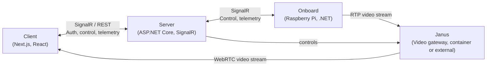
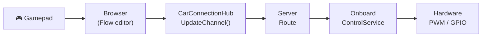
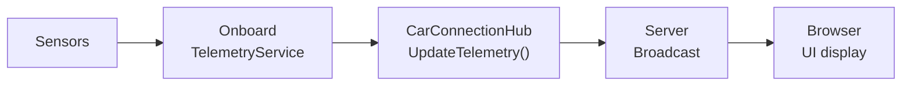
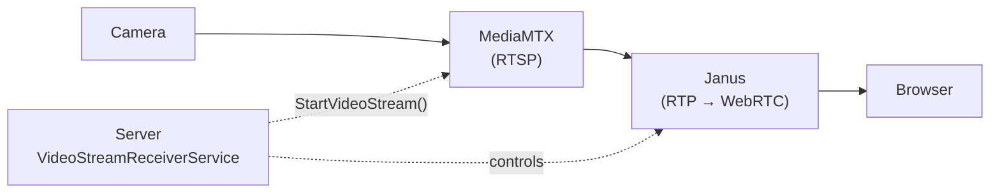
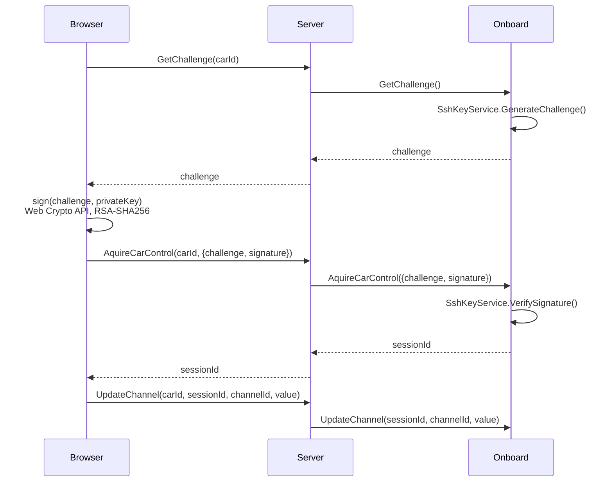
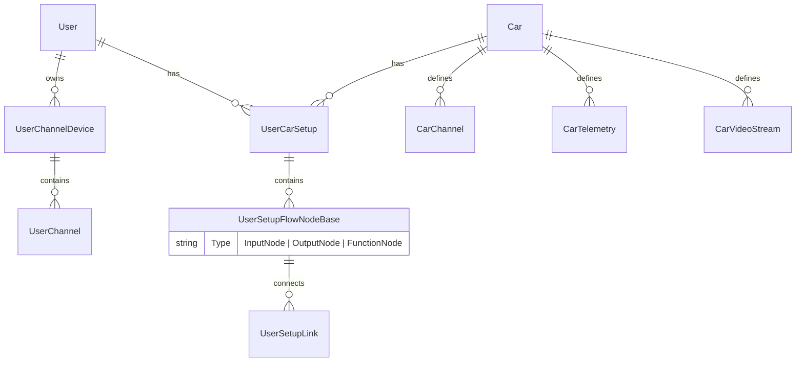

# Architecture – LteCar

## Overview

LteCar is a system for remotely controlling vehicles over the internet (LTE/WiFi). A user controls a real vehicle in real time through a web interface, sees its camera feed via a WebRTC video stream, and receives telemetry data. Communication between all components runs primarily over **SignalR** (WebSocket-based).

```mermaid
graph LR
    Client["Client<br/>(Next.js, React)"]
    Server["Server<br/>(ASP.NET Core, SignalR)"]
    Onboard["Onboard<br/>(Raspberry Pi, .NET)"]
    Janus["Janus<br/>(Video gateway, container or external)"]

    Client <-- "SignalR / REST<br/>Auth, control, telemetry" --> Server
    Server <-- "SignalR<br/>Control, telemetry" --> Onboard
    Onboard -- "RTP video stream" --> Janus
    Janus -- "WebRTC video stream" --> Client
    Server -- "controls" --> Janus
```

---

## Projects and technologies

| Project | Description | Technologies |
|---------|-------------|-------------|
| **Server** | Central hub for vehicles and users. Hosts the REST API and all SignalR hubs. Manages the database, video streams, and routing. | ASP.NET Core 8, SignalR, EF Core 9 (SQL Server), MessagePack |
| **Onboard** | Runs on the vehicle (Raspberry Pi). Connects to the server, receives control commands, drives hardware (PWM/GPIO), and sends telemetry and video. | .NET 8 Console App, System.Device.Gpio, TypedSignalR, MediaMTX |
| **Client** | Web UI in the browser. Control via gamepad, configuration through a flow editor, video reception via WebRTC. | Next.js 15, React 19, ReactFlow, Zustand, Web Crypto API |
| **Shared** | Shared DTOs, interfaces, and utilities for Server and Onboard. | .NET 8 Class Library |
| **Janus** | WebRTC gateway. Receives RTP streams from the vehicle and delivers them to the browser via WebRTC. | Janus Gateway (container or external) |

---

## Actors

### User (Web User)

The user opens the web application in a browser. They select a vehicle, authenticate via an SSH-key challenge, configure control mapping through a visual flow editor, and drive the vehicle with a gamepad. They see the camera feed and receive telemetry data in real time.

### Vehicle (Onboard)

The vehicle is a Raspberry Pi with attached hardware (motors, servos, sensors, camera). The onboard software connects to the server automatically on startup, registers itself with its `CarIdentityKey`, synchronizes the channel configuration (ChannelMap), and waits for control commands. It streams video via MediaMTX and sends telemetry data.

### Server

The server is the central intermediary. It manages user sessions, vehicle connections, and the database. It routes control commands from the browser to the correct vehicle and telemetry data back. It controls Janus for video streaming and provides the REST API for CRUD operations. In the standard deployment, it runs as a container alongside Postgres, Janus, and the client.

### Janus (video gateway)

Janus receives RTP video streams from the vehicles and converts them into WebRTC streams for the browser. The server controls Janus via its API (port allocation, stream management).

### Gamepad

A physical input device (e.g. an Xbox controller) read out in the browser via the Gamepad API. Axes and buttons are mapped to vehicle channels through the flow editor.

---

## Signal flow

### Control (gamepad → vehicle)

```mermaid
graph LR
    Gamepad["🎮 Gamepad"]
    Browser["Browser<br/>(Flow editor)"]
    Hub["CarConnectionHub<br/>UpdateChannel()"]
    Server["Server<br/>Route"]
    Onboard["Onboard<br/>ControlService"]
    HW["Hardware<br/>PWM / GPIO"]

    Gamepad --> Browser
    Browser --> Hub
    Hub --> Server
    Server --> Onboard
    Onboard --> HW
```

1. The browser reads gamepad input and updates the input nodes in the flow graph.
2. The flow graph propagates the values through function nodes (rescale, clamp, gearbox, ...) to the output nodes.
3. Each output node calls `UpdateChannel(carId, sessionId, channelId, value)` on the **CarConnectionHub**.
4. The server routes the call to the vehicle's SignalR connection using the `connectionMap`.
5. The `ControlService` on the vehicle delegates to the `ControlExecutionService`, which forwards the value to the hardware (PWM/GPIO).

### Telemetry (vehicle → browser)

```mermaid
graph LR
    Sensors["Sensors"]
    Onboard["Onboard<br/>TelemetryService"]
    Hub["CarConnectionHub<br/>UpdateTelemetry()"]
    Server["Server<br/>Broadcast"]
    Browser["Browser<br/>UI display"]

    Sensors --> Onboard --> Hub --> Server --> Browser
```

1. The `TelemetryService` on the vehicle periodically reads the sensors.
2. It calls `UpdateTelemetry(carId, channelName, value)` on the **CarConnectionHub**.
3. The server broadcasts the value to all clients in the vehicle's group.

### Video (vehicle → browser)

```mermaid
graph LR
    Kamera["Camera"]
    MediaMTX["MediaMTX<br/>(RTSP)"]
    Janus["Janus<br/>(RTP → WebRTC)"]
    Browser["Browser"]
    Server["Server<br/>VideoStreamReceiverService"]

    Kamera --> MediaMTX --> Janus --> Browser
    Server -. "controls" .-> Janus
    Server -. "StartVideoStream()" .-> MediaMTX
```

1. The browser requests a video stream via the **CarConnectionHub**.
2. The server allocates a Janus RTP endpoint through the `VideoStreamReceiverService`.
3. The server sends `StartVideoStream(streamId, settings)` to the vehicle.
4. The vehicle starts MediaMTX with the requested settings (resolution, frame rate, bitrate).
5. MediaMTX streams the camera feed to Janus via RTP.
6. Janus converts the stream to WebRTC and delivers it to the browser.

### Gamepad synchronization (browser → browser)

When multiple browser tabs or devices use the same gamepad, the **UserChannelHub** synchronizes the values:

1. Browser A sends `UpdateUserChannelValue(userChannelId, value)`.
2. The server broadcasts to the group `gamepad-{deviceId}` (excluding the sender).
3. Browser B receives `ReceiveUserChannelValue` and updates the flow graph.

### Channel synchronization (onboard → server)

When the connection is established, the vehicle synchronizes its channel configuration:

1. Onboard calls `OpenCarConnection(carIdentityKey, channelMapHash)`.
2. On a hash mismatch, Onboard calls `SyncChannelMap(channelMap)`.
3. The server updates the database and returns the assigned numeric IDs.
4. Onboard stores the result locally in `channelMap.server.json`.

---

## Authentication

### User authentication (browser ↔ server)

User authentication is based on **cookies**:

1. The browser calls `/api/user/me`.
2. If no `LteCarAuth` cookie exists, the server creates a new user and signs a session with a **Sqids-encoded session token** as `ClaimTypes.NameIdentifier`.
3. The cookie is automatically sent with all subsequent requests (`HttpOnly`, `SameSite=Lax`, unlimited lifetime).
4. Controllers resolve the user via `GetCurrentUserAsync()` from the cookie.

**Session transfer**: A user can generate a short-lived code (5 minutes) via `/api/user/generate-transfer-code` to transfer their session to another device (e.g. from phone to desktop).

### Vehicle authentication (onboard → server)

The vehicle identifies itself using a **CarIdentityKey** (GUID):

1. On first startup, a GUID is generated in `carIdentityKey.txt`.
2. On every connection, Onboard sends the key to `OpenCarConnection`.
3. The server creates the vehicle automatically if it does not already exist.

There is no TLS client authentication; identification happens exclusively via the CarIdentityKey.

### Control authentication (browser ↔ onboard via server)

Control authorization is acquired through an **SSH-key challenge-response mechanism**:

```mermaid
sequenceDiagram
    participant B as Browser
    participant S as Server
    participant O as Onboard

    B->>S: GetChallenge(carId)
    S->>O: GetChallenge()
    O->>O: SshKeyService.GenerateChallenge()
    O-->>S: challenge
    S-->>B: challenge

    B->>B: sign(challenge, privateKey)<br/>Web Crypto API, RSA-SHA256

    B->>S: AquireCarControl(carId, {challenge, signature})
    S->>O: AquireCarControl({challenge, signature})
    O->>O: SshKeyService.VerifySignature()
    O-->>S: sessionId
    S-->>B: sessionId

    B->>S: UpdateChannel(carId, sessionId, channelId, value)
    S->>O: UpdateChannel(sessionId, channelId, value)
```

1. **Key generation**: On first startup, Onboard generates an RSA-2048 key pair (PKCS#8 / SPKI DER).
2. **Key transfer**: The browser downloads the private key directly from the vehicle:
   - The browser fetches the identity hash from the server: `GET /api/car/{carId}/identity-hash` → SHA-256 of the CarIdentityKey.
   - The browser calls `http://{vehicle-ip}:8080/ssh-key?hash={identityHash}`.
   - Onboard checks the hash and only serves the private key if it matches.
3. **Challenge**: The browser calls `GetChallenge(carId)` on the CarConnectionHub. The server forwards this to the vehicle, which generates a random challenge string.
4. **Signature**: The browser signs the challenge with the private key (Web Crypto API, RSA-SHA256).
5. **Verification**: The browser sends `AquireCarControl(carId, {challenge, signature})`. Onboard verifies the signature with the public key.
6. **Session**: On success, Onboard returns a `sessionId` (ShortGuid). All subsequent control commands (`UpdateChannel`) must include this `sessionId`.

### Access control

- **UserSetup**: A user needs a setup for a vehicle in order to see and control its functions.
- **UserCarSetup**: Created automatically after successful SSH authentication.
- There is **no role-based authorization** (no roles or policies). Access control is based on ownership of the SSH key and membership in a UserSetup.

---

## SignalR hubs

The vehicle-side hubs were consolidated: `CarControlHub`, `TelemetryHub`, and `CarVideoHub` no longer exist as separate hub classes — control, telemetry, and video signaling all moved onto `CarConnectionHub`. `CarUiHub` still exists as a path constant in `Shared/HubPaths.cs`, but no hub class implements it and it is never mapped in `Server/Program.cs` — it is dead code. `CarAudioHub` exists as a hub class (`Server/Hubs/CarAudioHub.cs`) but is not registered/mapped in `Program.cs` either, so it is currently unreachable.

| Hub | Path | Direction | Purpose |
|-----|------|----------|-------|
| **CarConnectionHub** | `/hubs/connection` | Onboard ↔ Server ↔ Browser | The single vehicle-side hub: registration, ChannelMap sync, control commands, SSH auth, telemetry, video-stream signaling |
| **UserChannelHub** | `/hubs/userchannel` | Browser ↔ Server ↔ Browser | Gamepad synchronization |
| **CarBashHub** | `/hubs/carbash` | Browser → Server → Onboard | Bash command dispatch (output streams back via `CarConnectionHub`) |

---

## REST API

| Controller | Base path | Endpoints |
|-----------|-----------|-----------|
| **CarController** | `/api/car` | Vehicle list, channels, setup, identity hash |
| **UserController** | `/api/user` | Session (`/me`), transfer codes |
| **UserConfigController** | `/api/userconfig` | Setup, gamepads, filter types |
| **FlowController** | `/api/flow` | Flow nodes and links (CRUD) |
| **WebRtcController** | `/api/webrtc` | `GET /ice-servers` – STUN (always) and TURN (if configured) server list for the Janus session |

---

## Data model

```mermaid
erDiagram
    User ||--o{ UserCarSetup : has
    User ||--o{ UserChannelDevice : owns
    UserChannelDevice ||--o{ UserChannel : contains

    Car ||--o{ UserCarSetup : has
    Car ||--o{ CarChannel : defines
    Car ||--o{ CarTelemetry : defines
    Car ||--o{ CarVideoStream : defines

    UserCarSetup ||--o{ UserSetupFlowNodeBase : contains
    UserSetupFlowNodeBase ||--o{ UserSetupLink : connects

    UserSetupFlowNodeBase {
        string Type "InputNode | OutputNode | FunctionNode"
    }
```

- **User**: session token, transfer codes, last access.
- **Car**: identity key, name, ChannelMap hash.
- **CarChannel / CarTelemetry / CarVideoStream**: vehicle channels (control, telemetry, video).
- **UserCarSetup**: link between user ↔ vehicle.
- **UserChannelDevice / UserChannel**: gamepad devices and their axes/buttons.
- **UserSetupFlowNodeBase / UserSetupLink**: flow graph (input, output, and function nodes and their connections).

---

## Configuration files

| File | Location | Contents |
|-------|-----|--------|
| `appSettings.json` | Server | Janus config, connection string, ID salt, logging, WebRTC/TURN config |
| `appSettings.json` | Onboard | Server URL, camera settings, logging |
| `channelMap.json` | Onboard | Definition of the control, telemetry, and video channels |
| `channelMap.server.json` | Onboard | Cached server response from channel synchronization |
| `carIdentityKey.txt` | Onboard | Generated GUID for vehicle identification |
| `ssh_key` / `ssh_key.pub` | Onboard | RSA key pair for control authentication |
